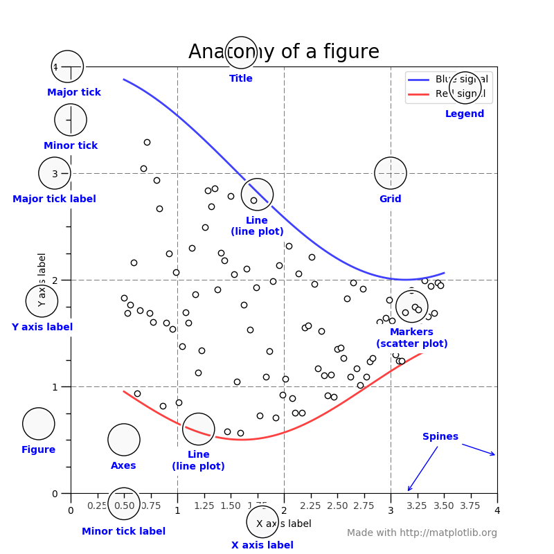

# Matplotlib

## Basics

* Never use `pylab`
  * deprecated
  * pollutes global namespace
* Import Matplotlib
```python3
import matplotlib.pyplot as plt
```
* A plot is a hierarchy of nested Python objects
  * `Figure`
    * contains multiple `Axes`: actual plots
  * `Axes`
    * contains `Axis`

* Stateful interface always tracks the current axes in the current figure
```python3
plt.plot()

def plot(*args, **kwargs):
     """An abridged version of plt.plot()."""
     ax = plt.gca()
     return ax.plot(*args, **kwargs)

def gca(**kwargs):
     """Get the current Axes of the current Figure."""
     return plt.gcf().gca(**kwargs)
```
* Eg
```python3
plt.title()   # calls the corresponding getter/setter methods ax.set_title()
plt.grid()    # same
plt.legend()  # same
plt.ylabels() # same
```

## Subplots

* Create a `Figure` and `Axes`
```python3
fig, ax = plt.subplots()  # defaut call is subplots(nrows=1, ncols=1)
```
* Create multiple subplots
```python3
fig, ((ax1, ax2), (ax3, ax4)) = plt.subplots(nrows=2, ncols=2, figsize=(7, 7))

# Similarly
fig, ax = plt.subplots(nrows=2, ncols=2, figsize=(7, 7))
ax1, ax2, ax3, ax4 = ax.flatten()  # flatten a 2d NumPy array to 1d
```

```python3
gridsize = (3, 2)
fig = plt.figure(figsize=(12, 8))
ax1 = plt.subplot2grid(gridsize, (0, 0), colspan=2, rowspan=2)
ax2 = plt.subplot2grid(gridsize, (2, 0))
ax3 = plt.subplot2grid(gridsize, (2, 1))

ax1.set_title('Home value as a function of home age & area population', fontsize=14)
sctr = ax1.scatter(x=age, y=pop, c=y, cmap='RdYlGn')
plt.colorbar(sctr, ax=ax1, format='$%d')
ax1.set_yscale('log')
ax2.hist(age, bins='auto')
ax3.hist(pop, bins='auto', log=True)

add_titlebox(ax2, 'Histogram: home age')
add_titlebox(ax3, 'Histogram: area population (log scl.)')
```

### Examples

* One subplot with a `stackplot`
```python3
import matplotlib.pyplot as plt
import numpy as np

rng = np.arange(50)
rnd = np.random.randint(0, 10, size=(3, rng.size))
yrs = 1950 + rng

fig, ax = plt.subplots(figsize=(5, 3))
ax.stackplot(yrs, rng + rnd, labels=['Eastasia', 'Eurasia', 'Oceania'])
ax.set_title('Combined debt growth over time')
ax.legend(loc='upper left')
ax.set_ylabel('Total debt')
ax.set_xlim(xmin=yrs[0], xmax=yrs[-1])
fig.tight_layout()
```

* Multiple subplots
```
import matplotlib.pyplot as plt
import numpy as np

x = np.random.randint(low=1, high=11, size=50)
y = x + np.random.randint(1, 5, size=x.size)
data = np.column_stack((x, y))

fig, (ax1, ax2) = plt.subplots(nrows=1, ncols=2, figsize=(8, 4))

ax1.scatter(x=x, y=y, marker='o', c='r', edgecolor='b')
ax1.set_title('Scatter: $x$ versus $y$')
ax1.set_xlabel('$x$')
ax1.set_ylabel('$y$')

ax2.hist(data, bins=np.arange(data.min(), data.max()), label=('x', 'y'))
ax2.legend(loc=(0.65, 0.8))
ax2.set_title('Frequencies of $x$ and $y$')
ax2.yaxis.tick_right()
```

## Pandas

* Pandas plotting methodss are just wrappers around matplotlib calls


## Resources

* [Python plotting with Matplotlib](https://realpython.com/blog/python/python-matplotlib-guide/)
* [Cheatsheet](https://s3.amazonaws.com/assets.datacamp.com/blog_assets/Python_Matplotlib_Cheat_Sheet.pdf)
* [Matplotlib Official Tutorials](https://matplotlib.org/tutorials/index.html)
